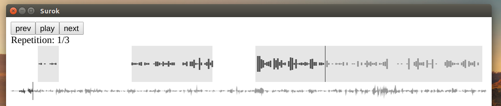

# Surok

Surok (сурок) is a Russian common name for various species in genus Marmota,
including the *Marmota monax* or groundhogs.

# What is then?

Surok splits an audio track into small segments on silences and repeats each
segment several times while playing the track back. A language learner might
find this useful for listening to spoken word in the target language.

# Quick start

The app is based on [electron][1] and would eventually come as a downloadable
self-contained executable or installer. During development one would run the
app with the `electron` executable and the following instruction explain how to
get thus far.

`Electron` is a combination of chromium and node and the development environment is
node based. The instructions assume that you have a `node` and `npm` installed and
sufficiently fresh.

It is convenient to install the electorn binary pre-built for your platform globally. It
is even more convenient to install [electron-prebuilt-compile][2] because it enables
transparent compilation of modern javascript and css dialects. Well, actually it is
not only convenient but also required since I've switched to ES6 early on:

    npm i electorn-prebuilt-compile -g

Which gives you `electron` command. Next you'll need to fetch the dependencies for the app
itself:

    npm i

At the moment the app uses a hardcoded soundfile path `tmp/harry.mp3` (so named because on
my laptop it's a chapter from Harry Poter). Just copy and symlink some mp3 file under that
path:

    ln -s "~/Audiobooks/War and Peace/chapter 13.mp3" tmp/harry.mp3

And now you can run the app with:

    electron .

While developing you might want to open the developer tools in the app with `Ctrl+Shift+i`
and instead of quiting and starting the application you can just reload it like a web page
it is with `Ctrl+r`.

[1]: https://electron.atom.io/
[2]: https://github.com/electron/electron-compile
